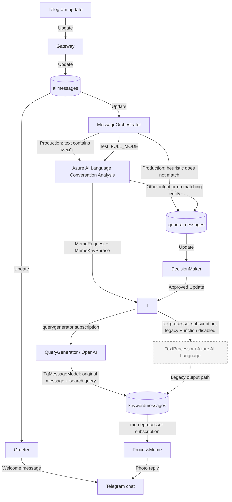
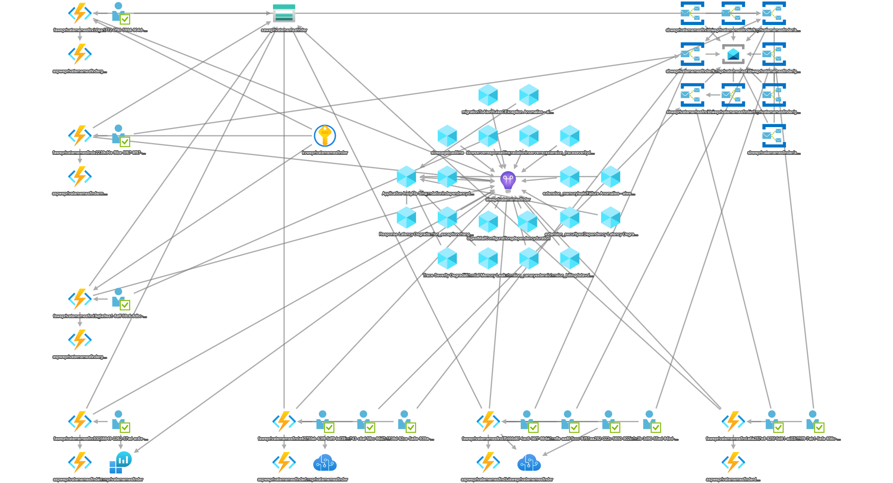

## MemesFinderBot

### CI\CD statuses
Infrastructure: 

Gateway: 

Orchestrator: 

Greeter: 

DecisionMaker: 

TextProcessor: 

ProcessMeme: 

Reporter: 

### Description

This Telegram bot listens to group messages and can reply with a related picture. Search queries are generated from message text by the QueryGenerator service using the OpenAI API. The bot also supports dedicated meme requests, detected by the MessageOrchestrator's Azure Language conversation analysis.

For picture search we are utilizing [Google Custom Search](https://developers.google.com/custom-search/v1/introduction) and it`s [.NET Client Library](https://developers.google.com/api-client-library/dotnet/apis/customsearch/v1)

Communication with Telegram through [Telegram.Bot](https://github.com/TelegramBots/Telegram.Bot) library for .NET

This project using only SaaS model of Azure resources (nothing for IaaS/PaaS or On-Premise)

## Services repositories

[Gateway](https://github.com/ArtemKiyashko/memesfinder-gateway) - receiving Telegram HTTP updates with messages from chat. 

[Orchestrator](https://github.com/ArtemKiyashko/memesfinder-messageorchestrator) - decides whenever it's a general message and should be processed through the DecisionMaker or dedicated meme request and should response immediately.

[DecisionMaker](https://github.com/ArtemKiyashko/memesfinder-decisionmaker) - this service takes the responsibility of taking the decision for processing particular message. If positive dicision taken - just forwarding message to ServiceBus topic.

[QueryGenerator](https://github.com/ArtemKiyashko/memesfinder-querygenerator) - generates a concise image-search query from the Telegram message with the OpenAI API and publishes a `TgMessageModel` to `keywordmessages`.

[TextProcessor](https://github.com/ArtemKiyashko/memesfinder-textprocessor) - legacy Azure Cognitive Services key-phrase extraction. Its Function is disabled by the ARM template; the Function App and its Service Bus subscription are retained temporarily during the QueryGenerator migration.

[ProcessMeme](https://github.com/ArtemKiyashko/memesfinder-processmeme) - finds a picture using the search query received in `TgMessageModel` from `keywordmessages` and replies to the original Telegram message.

[Greeter](https://github.com/ArtemKiyashko/memesfinder-greeter) - sending welcome message to new chat memebrs

[Reporter](https://github.com/ArtemKiyashko/memesfinder-reporter) - processing and sending reports to the chat, based on Azure Monitor data collected

## Architecture

Stateless microservices based on Azure Function Apps with consumption service plans (can be changed in `parameters.json` files).

Azure Service Bus as event bus and message broker for communication between services.

### Current data flow

`textmessages` is the handoff topic for meme-search requests. MessageOrchestrator uses Azure AI Language Conversation Analysis to decide whether an update is a direct meme request: in Production, `SEMI_MODE` first checks for the word “мем”; in Test, `FULL_MODE` analyzes every valid message. Direct requests and messages approved by DecisionMaker are sent to `textmessages`. QueryGenerator consumes its dedicated subscription, creates the search query, and publishes the result to `keywordmessages`. ProcessMeme consumes that result and replies in Telegram.

```mermaid
flowchart TD;
A[Telegram update] -->|Update| B[Gateway]
B -->|Update| C[(allmessages)]
C -->|Update| O[MessageOrchestrator]
C -->|Update| G[Greeter]
G -->|Welcome message| TG[Telegram chat]
O -->|Production: text contains “мем”| AI[Azure AI Language Conversation Analysis]
O -->|Production: heuristic does not match| GM[(generalmessages)]
O -->|Test: FULL_MODE| AI
AI -->|MemeRequest + MemeKeyPhrase| T
AI -->|Other intent or no matching entity| GM
GM -->|Update| D[DecisionMaker]
D -->|Approved Update| T
T -->|querygenerator subscription| Q[QueryGenerator / OpenAI]
Q -->|TgMessageModel: original message + search query| K[(keywordmessages)]
K -->|memeprocessor subscription| P[ProcessMeme]
P -->|Photo reply| TG
T -.->|textprocessor subscription; legacy Function disabled| L[TextProcessor / Azure AI Language]
L -.->|Legacy output path| K
classDef legacy fill:#f5f5f5,stroke:#888,stroke-dasharray: 5 5,color:#666;
class L legacy;
```

Legend:
 - `FA` - Azure Function App
 - `SB` - ServiceBus topic
 - `Update` - incoming Telegram message from chat
 - `TgMessageModel` - original Telegram `Message` plus the generated image-search query

### Migration status and remaining legacy

- **QueryGenerator is the active search-query generation path.** It consumes `textmessages/querygenerator` and publishes to `keywordmessages`.
- **TextProcessor is legacy and disabled** in the ARM template with `AzureWebJobs.MemesFinderTextProcessor.Disabled=true`. Its Function App, `textmessages/textprocessor` subscription, related role assignments, and Cognitive Services resources are still defined in infrastructure and remain cleanup candidates after production verification. Since the subscription still exists, it can accumulate messages until it is removed or expires them.
- **MessageOrchestrator still uses Azure AI Language Conversations** to recognize dedicated/direct meme requests. This is request detection, not the old search-keyphrase generation path, and is intentionally retained for now.
- **ProcessMeme remains active and unchanged** as the consumer of `keywordmessages`; Google Custom Search and Telegram delivery still use the generated query.
- **Function runtime:** all Function Apps target .NET 10 isolated workers. Shared domain, model, and manager libraries may target compatible earlier TFMs where no Functions host/runtime is involved.

### Resources to be created by this ARM template

