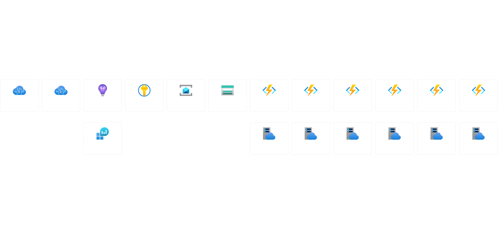

## MemesFinderBot

### CI\CD tatuses
Infrastructure: 

Gateway: 

TextProcessor: 

ProcessMeme: 

### Description

This telegram bot is basically listening for the group messages, randomly chosing one of and replying with the picture, related to the one of the key phrase from the original message.

As a key phrase extractor we are using [Azure Text Analytics](https://azure.microsoft.com/en-us/products/cognitive-services/text-analytics/#overview) service (part of Cognitive Services)

For picture search we are utilizing [Google Custom Search](https://developers.google.com/custom-search/v1/introduction) and it`s [.NET Client Library](https://developers.google.com/api-client-library/dotnet/apis/customsearch/v1)

Communication with Telegram through [Telegra.Bot](https://github.com/TelegramBots/Telegram.Bot) library for .NET

This project using only SaaS model of Azure resources (nothing for IaaS/PaaS or On-Premise)

## Services repositories

[Gateway](https://github.com/ArtemKiyashko/memesfinder-gateway) - receiving Telegram HTTP updates with messages from chat. This service takes the responsibility of taking the decision for processing particular message. If positive dicision taken - just forwarding message to ServiceBus topic

[TextProcessor](https://github.com/ArtemKiyashko/memesfinder-textprocessor) - finding key phrases in original message via Azure Congnitive Services

[ProcessMeme](https://github.com/ArtemKiyashko/memesfinder-processmeme) - finding proper picture based on the key phrase received from `TextProcessor`. If picture found - replying to original Telegram message with that picture.

## Architecture

Stateless microservices based on Azure Function Apps with consumption service plan (can be changed in `parameters.json` file).

Azure Service Bus as event bus and message broker for communication between services.

### Data flow:

Legend:
 - `FA` - Azure Function App
 - `SB` - ServiceBus topic
 - `Update` - incoming Telegram message from chat
 - `UpdateWithKeyword` - composite model including original Telegram message model and key phrase

### Resources to be created by this ARM template

